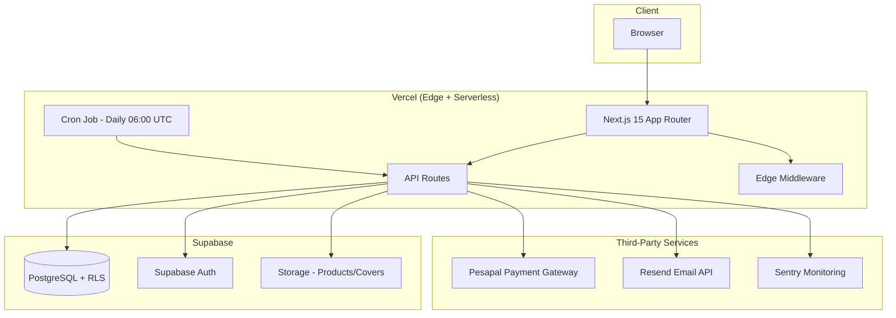
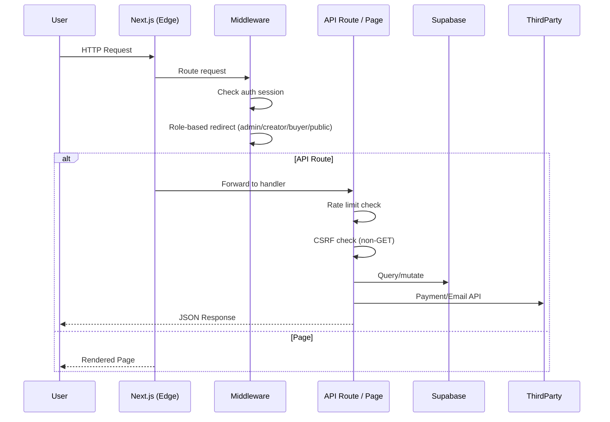
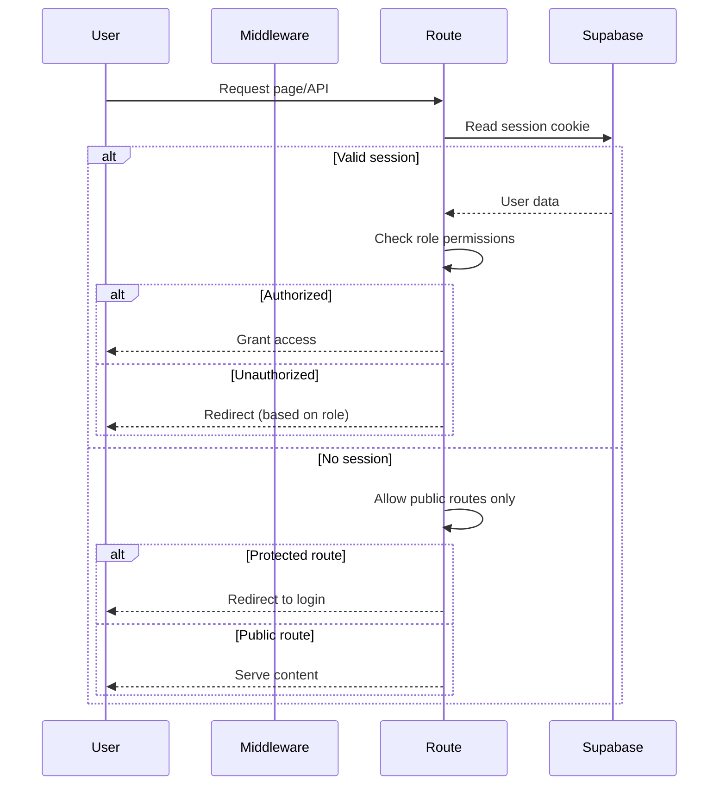
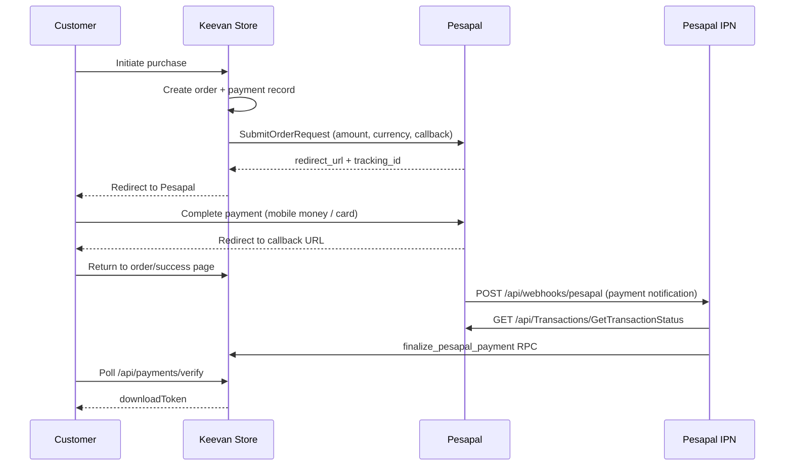

# Technical Documentation — Keevan Store

**Document Version:** 1.0  
**Date:** July 2026

---

## 1. System Architecture

### 1.1 High-Level Architecture

Keevan Store follows a modern JAMstack architecture:



### 1.2 Request Flow



---

## 2. Folder Structure

```
C:\Keevan Store\
├── app/                          # Next.js App Router
│   ├── layout.tsx                # Root layout (metadata, fonts, providers)
│   ├── page.tsx                  # Landing page
│   ├── globals.css               # Tailwind + brand tokens
│   ├── error.tsx                 # Root error boundary
│   ├── global-error.tsx          # Global Sentry error boundary
│   ├── not-found.tsx             # 404 page
│   ├── sitemap.ts                # Dynamic sitemap
│   ├── robots.ts                 # Robots.txt
│   ├── api/                      # All backend API routes (~52 files)
│   │   ├── auth/                 # Login, register, logout, password reset
│   │   ├── payments/             # Create, confirm, verify payments
│   │   ├── orders/               # Order CRUD + lookup
│   │   ├── products/             # Product CRUD
│   │   ├── stores/               # Store CRUD
│   │   ├── upload/               # File upload
│   │   ├── admin/                # All admin endpoints (~23 routes)
│   │   ├── webhooks/             # Pesapal IPN webhook
│   │   ├── buyer/                # Buyer-specific endpoints
│   │   ├── downloads/            # Signed download URL generation
│   │   ├── reviews/              # Product reviews
│   │   ├── refunds/              # Refund request submission
│   │   ├── withdrawals/          # Withdrawal request CRUD
│   │   ├── analytics/            # Event tracking + summary
│   │   ├── discounts/            # Discount CRUD
│   │   ├── cart/                 # Cart operations
│   │   ├── emails/               # Email processing
│   │   ├── cron/                 # Scheduled tasks
│   │   ├── creators/             # Creator profile
│   │   ├── pesapal/              # Pesapal IPN endpoint
│   │   └── setup/                # One-time setup (IPN registration)
│   ├── [public pages]            # About, contact, FAQ, features, pricing, etc.
│   ├── store/[handle]/           # Creator storefront pages
│   ├── product/[slug]/           # Product detail pages
│   ├── checkout/[slug]/          # Checkout pages
│   ├── download/[slug]/          # Download pages
│   ├── creator/                  # Creator dashboard pages
│   ├── buyer/                    # Buyer dashboard pages
│   └── admin/                    # Admin dashboard pages
├── components/                   # Shared React components (19 files)
│   ├── ui/                       # UI primitives (toast, modal, badge, etc.)
│   ├── site-header.tsx
│   ├── site-footer.tsx
│   ├── checkout-form.tsx
│   ├── dashboard-shell.tsx
│   └── ...
├── lib/                          # Shared business logic (13 files)
│   ├── api.ts                    # API utilities, error handling, rate limiting, CSRF
│   ├── auth.ts                   # Auth helpers
│   ├── schemas.ts                # Zod validation schemas
│   ├── constants.ts              # Platform constants
│   ├── pesapal.ts                # Pesapal payment integration
│   ├── email.ts                  # Email sending + queue
│   ├── email-templates.ts        # HTML email templates
│   ├── email-processor.ts        # Email processing logic
│   ├── file-validation.ts        # Magic-byte validation
│   ├── storefront.ts             # Storefront data helpers
│   ├── supabase.ts               # Browser Supabase client
│   ├── supabase-server.ts        # Server Supabase client
│   ├── utils.ts                  # Shared utility functions
│   └── __tests__/                # 26 test files
├── supabase/
│   └── migrations/               # 29 SQL migration files
├── public/                       # Static assets + LLM resources
├── scripts/                      # Utility scripts (seed, migrate, register-ipn)
├── docs/                         # Documentation (15 files)
├── k6/                           # Load testing scripts (5 files)
├── .github/workflows/            # CI pipeline
├── middleware.ts                 # Auth + role-based routing
├── next.config.mjs               # Next.js configuration
├── tailwind.config.ts            # Tailwind configuration
├── tsconfig.json                 # TypeScript configuration
├── vitest.config.ts              # Test configuration
└── vercel.json                   # Vercel deployment configuration
```

---

## 3. Frontend Architecture

### 3.1 Framework & Rendering

- **Framework:** Next.js 15 with React 19
- **Router:** App Router (file-based routing)
- **Rendering Strategy:** Mix of Server Components (default) and Client Components (where interactivity needed)
- **TypeScript:** Strict mode enabled
- **Styling:** Tailwind CSS 3 with custom brand design tokens

### 3.2 Component Tree

```
Root Layout (app/layout.tsx)
├── ToastProvider
├── AuthProvider
├── CookieConsent
├── site-header-auth.tsx
├── site-header.tsx (public pages)
├── Page Content (per route)
└── site-footer.tsx
```

### 3.3 Dashboard Layout
```
Dashboard Shell (components/dashboard-shell.tsx)
├── Sidebar Navigation (role-specific)
├── Mobile Navigation (components/mobile-nav.tsx)
├── Notifications Dropdown
├── Main Content Area
└── Back-to-top button
```

### 3.4 Key Client Components

| Component | Purpose | Key Dependencies |
|-----------|---------|------------------|
| `checkout-form.tsx` | Payment form with phone validation | Pesapal API, currency phone regex |
| `buy-now-modal.tsx` | Inline checkout modal | Checkout form |
| `payment-status-card.tsx` | Payment verification + download | Polling, download API |
| `product-reviews.tsx` | Review display + submission form | Reviews API |
| `sales-chart.tsx` | Revenue area chart | Recharts |
| `track-view.tsx` | Anonymous view tracking | Analytics API |

---

## 4. Backend Architecture

### 4.1 API Route Pattern

Every API route follows the same pattern:

```typescript
import { apiError, json, readJson, requireUser, withErrorHandling } from "@/lib/api";

export const METHOD = withErrorHandling(async (request: NextRequest) => {
  // 1. Auth check (if needed)
  const { supabase, authUser, profile } = await requireUser(request);
  
  // 2. Parse + validate input (if needed)
  const input = await readJson(request, someSchema);
  
  // 3. Business logic
  // ...
  
  // 4. Return response
  return json({ data });
});
```

### 4.2 Error Handling Pipeline

```
Handler throws error
  → withErrorHandling catches
    → If status >= 500: console.error + Sentry.captureException
    → If status < 500: console.warn
    → Returns JSON: { error: { message, details } }
```

### 4.3 Rate Limiting

- **Mechanism:** Database-backed via `rate_limits` table
- **Default limit:** 120 requests per minute per IP
- **Storage:** IP-based tracking with 60-second windows
- **Error response:** HTTP 429 with retry guidance

### 4.4 CSRF Protection

- **Method:** Origin/Referer header validation
- **Scope:** All non-GET/HEAD requests
- **Allowed origins:** Derived from `NEXT_PUBLIC_SITE_URL`, `Host` header, `VERCEL_URL`
- **Error response:** HTTP 403

---

## 5. Database Schema

### 5.1 Core Tables

The database contains approximately 20 tables across the public schema. Key tables:

| Table | Purpose | Key Constraints |
|-------|---------|-----------------|
| `users` | User accounts (auth metadata) | FK to `auth.users`, role enum |
| `creators` | Creator profiles | FK to users, unique per user |
| `stores` | Creator storefronts | FK to creators, unique slug, currency enum |
| `products` | Digital products | FK to stores + creators, file validation constraints |
| `orders` | Purchase transactions | FK to products + creators, status enum |
| `payments` | Payment records | FK to orders, merchant reference |
| `withdrawal_requests` | Creator payout requests | FK to creators, status enum |
| `refunds` | Customer refunds | FK to orders + payments, status enum |
| `reviews` | Product reviews | FK to products + buyers, unique per buyer+product |
| `buyers` | Buyer profiles | FK to users |
| `buyer_purchases` | Purchase records for buyers | FK to buyers + orders + products |
| `discounts` | Product discounts | FK to products, date-range limited |
| `email_queue` | Queued email notifications | Status enum, retry count |
| `email_templates` | Email template storage | Named templates |
| `notifications` | In-app notifications | FK to users, read/unread |
| `analytics_events` | Event tracking | Event type enum, metadata JSONB |
| `rate_limits` | Rate limiting counters | Composite key (ip + window_start) |
| `admin_logs` | Admin audit trail | FK to admin user, action + metadata |
| `cart_items` | Shopping cart items | FK to buyers + products |
| `downloads` | Download token tracking | Token, expiry, FK to orders + products |

### 5.2 Key Database Constraints

```sql
-- Products
price integer not null check (price > 0)
file_size integer not null check (file_size <= 4194304)     -- 4 MB
file_mime text not null check (file_mime IN ('application/pdf','application/epub+zip','application/x-mobipocket-ebook','application/zip'))
cover_size integer check (cover_size <= 2097152)            -- 2 MB
UNIQUE (store_id, slug)

-- Orders
amount integer not null check (amount > 0)
platform_fee integer not null check (platform_fee >= 0)
creator_earnings integer not null check (creator_earnings >= 0)

-- Creators
available_balance integer not null default 0 check (available_balance >= 0)
total_earnings integer not null default 0 check (total_earnings >= 0)

-- Stores
UNIQUE (slug)
```

### 5.3 Row-Level Security

RLS is enabled on all tables. Policies ensure:
- Creators can only access their own data
- Admins can access all data
- Public users can only read published products and active stores
- Storage buckets have per-user access policies

---

## 6. Authentication Flow



### Authentication Methods:
1. **Cookie-based (SSR):** Primary method — Supabase SSR library with cookie storage
2. **Bearer token (API):** Alternative for programmatic access

---

## 7. Authorization & Roles

| Role | Access Level | Middleware Route |
|------|-------------|------------------|
| `admin` | Full platform access | `/admin/*` |
| `creator` | Own store + products + orders | `/creator/*` |
| `buyer` | Own purchases + downloads | `/buyer/*` |
| `unauthenticated` | Public pages only | All other routes |

The middleware (`middleware.ts`) implements role-based routing:
- `/admin/*` → requires admin role, redirects non-admins
- `/creator/*` → requires creator role, redirects non-creators
- `/buyer/*` → requires buyer role, redirects non-buyers
- Public routes → accessible to all

---

## 8. API Documentation

A complete API specification is available in `docs/api-specification.md`. Summary:

| Method | Endpoint | Purpose | Auth |
|--------|----------|---------|------|
| POST | `/api/auth/register` | Creator registration | None |
| POST | `/api/auth/register-buyer` | Buyer registration | None |
| POST | `/api/auth/login` | Login | None |
| POST | `/api/auth/logout` | Logout | Session |
| GET | `/api/auth/me` | Current user profile | Session |
| POST | `/api/auth/check-handle` | Store handle availability | None |
| POST | `/api/auth/reset-password` | Request password reset | None |
| POST | `/api/auth/update-password` | Update password | Session |
| GET/POST | `/api/products` | List/Create products | Session (POST) |
| GET/PATCH/DELETE | `/api/products/[id]` | Read/Update/Delete product | Session |
| POST | `/api/upload` | Upload file | Session (creator) |
| GET | `/api/stores/[handle]` | Get storefront data | None |
| POST/PATCH/DELETE | `/api/stores`/`[id]` | Store CRUD | Session (creator) |
| POST | `/api/payments/create` | Create payment order | Optional |
| POST | `/api/payments/verify` | Verify payment | Session |
| GET | `/api/downloads/[token]` | Download file | Token |
| GET/POST | `/api/reviews` | List/Create reviews | Session (POST) |
| POST | `/api/refunds/request` | Submit refund | Optional |
| GET/POST | `/api/withdrawals` | List/Create withdrawals | Session (creator) |
| POST | `/api/analytics/events` | Track event | Optional |
| GET | `/api/analytics/summary` | Analytics summary | Session (creator) |
| POST | `/api/emails/process` | Process email queue | Admin |
| GET | `/api/cron/process-emails` | Cron trigger | CRON_SECRET |
| POST | `/api/webhooks/pesapal` | Pesapal IPN | IPN ID |
| Various | `/api/admin/*` | Admin operations | Admin |

---

## 9. Environment Variables

| Variable | Required | Description |
|----------|----------|-------------|
| `NEXT_PUBLIC_SITE_URL` | Yes | Production site URL |
| `NEXT_PUBLIC_SUPABASE_URL` | Yes | Supabase project URL |
| `NEXT_PUBLIC_SUPABASE_ANON_KEY` | Yes | Supabase anonymous key |
| `SUPABASE_SERVICE_ROLE_KEY` | Yes | Supabase service role key |
| `PESAPAL_CONSUMER_KEY` | Yes | Pesapal API consumer key |
| `PESAPAL_CONSUMER_SECRET` | Yes | Pesapal API consumer secret |
| `PESAPAL_IPN_ID` | Yes | Pesapal IPN registration ID |
| `PESAPAL_BASE_URL` | Yes | Pesapal API base URL |
| `RESEND_API_KEY` | Yes | Resend email API key |
| `SMTP_HOST` | Yes | SMTP server hostname |
| `SMTP_PORT` | Yes | SMTP server port |
| `SMTP_USER` | Yes | SMTP username |
| `SMTP_PASS` | Yes | SMTP password |
| `SMTP_FROM` | Yes | SMTP from address |
| `SENTRY_DSN` | Yes | Sentry error tracking DSN |
| `NEXT_PUBLIC_SENTRY_DSN` | Yes | Sentry public DSN |
| `CRON_SECRET` | Yes | Cron job authentication |
| `NEXT_PUBLIC_COMMISSION_RATE` | No | Platform commission (default: 0.1) |
| `NEXT_PUBLIC_MIN_WITHDRAWAL` | No | Minimum withdrawal (default: 50000) |
| `NEXT_PUBLIC_MIN_WITHDRAWAL_*` | No | Per-currency minimums |
| `NEXT_PUBLIC_GOOGLE_SITE_VERIFICATION` | No | Google Search Console |
| `NEXT_PUBLIC_SUPPORT_PHONE` | No | Support phone number |
| `NEXT_PUBLIC_SUPPORT_WHATSAPP` | No | WhatsApp support link |
| `ADMIN_EMAIL` | Dev only | Admin seed email |
| `ADMIN_PASSWORD` | Dev only | Admin seed password |
| `VERCEL_OIDC_TOKEN` | No | Vercel OIDC for deployments |

---

## 10. Third-Party Integrations

| Service | Integration Type | Usage |
|---------|-----------------|-------|
| **Supabase** | Database, Auth, Storage | Primary backend platform |
| **Pesapal** | Payment Gateway | Payment processing for East Africa |
| **Resend** | Email Service | Transactional email delivery |
| **Nodemailer (SMTP)** | Email Fallback | Secondary email delivery |
| **Sentry** | Error Monitoring | Client + server + edge error tracking |
| **Vercel** | Hosting + Analytics + Cron | Platform deployment |
| **GitHub Actions** | CI/CD | Automated testing + build |
| **Recharts** | Charting | Sales analytics visualization |
| **Next.js Image** | Image Optimization | Cover image optimization |
| **Google Search Console** | SEO | Search performance monitoring |

---

## 11. Payment Integration

### Pesapal Flow



### Payment Security:
1. **Three-way verification:** Client redirect → IPN webhook → Manual API verification
2. **Atomic finalization:** `finalize_pesapal_payment` RPC with `FOR UPDATE` locking
3. **Failure handling:** `fail_pesapal_payment` RPC for concurrent failure scenarios
4. **Duplicate detection:** Prevents double-processing of same payment

---

## 12. Storage Architecture

| Bucket | Visibility | Contents | Access |
|--------|-----------|----------|--------|
| `products` | Private | E-book files (PDF, EPUB, MOBI, ZIP) | Server-side only, signed URLs for downloads |
| `covers` | Public | Cover images (JPEG, PNG, WebP) | Public read |

File path convention: `{creator_uuid}/{random_uuid}.{ext}`

---

## 13. Deployment Process

### CI/CD Pipeline (GitHub Actions)

```yaml
# .github/workflows/ci.yml
- ubuntu-latest
- Node 20
- Steps:
  1. npm ci
  2. npm test (Vitest)
  3. npm run build (next build)
```

### Vercel Deployment

- Automatic deployment on push to `main` branch
- Environment variables injected via Vercel project settings
- Cron job configured in `vercel.json` (daily 06:00 UTC for email processing)

---

## 14. Testing Strategy

| Category | Files | Tests | Scope |
|----------|-------|-------|-------|
| Schema validation | 1 | 62 | Zod schemas for all entities |
| File validation | 1 | 44 | Magic-byte detection, MIME, extension |
| API routes | 3 | 55 | All API endpoints, auth, validation |
| Auth flows | 2 | 33 | Registration, login, password reset |
| Payment processing | 3 | 55 | Pesapal integration, verification, race conditions |
| Database security | 1 | 88 | RLS policies, rate limiting, CSRF |
| Email processing | 2 | 25 | Queue, cron, templates, deduplication |
| Error boundaries | 1 | 3 | React error boundaries |
| Components | 2 | 26 | Checkout form, UI components |
| Utilities | 4 | 85 | Constants, helpers, Supabase clients |
| Migrations | 1 | 40 | Database migration validation |
| **Total** | **27** | **609** | |

---

## 15. Known Technical Debt

| Issue | Impact | Priority |
|-------|--------|----------|
| Products table `currency` column has a hard constraint (`currency = 'UGX'`) inconsistent with multi-store currency support | Multi-currency products not functional despite UI support | High |
| Some admin routes use `requireUser` instead of `requireAdmin` at admin endpoint level (relying on middleware layer) | Defense-in-depth reduced | Medium |
| No TypeScript path alias configured for `@/` in vitest (uses manual path resolution) | Test imports inconsistent | Low |
| No database backup automation documented in code (manual procedures in docs) | Recovery time unknown | Medium |
| All prices stored as integers (lowest denomination) without consistent documentation | Confusion about price representation | Low |
| No input sanitization beyond Zod validation | Potential XSS risk in review/description fields | Medium |
| No automated database migration run in CI | Schema drift between environments | Medium |

---

## 16. Local Development Setup

### Prerequisites
- Node.js 20+
- npm
- Supabase account (free tier)
- Pesapal developer account
- Resend account (or SMTP credentials)

### Setup Steps

```bash
# 1. Clone repository
git clone <repository-url>
cd keevan-store

# 2. Install dependencies
npm install

# 3. Configure environment
cp .env.example .env.local
# Edit .env.local with your credentials

# 4. Run database migrations
node scripts/migrate.mjs

# 5. Run tests
npm test

# 6. Start development server
npm run dev
```

---

*This document is based on the actual Keevan Store codebase and configuration as of July 2026.*
